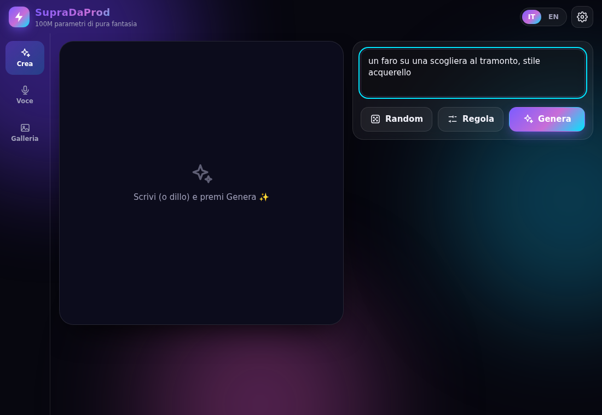
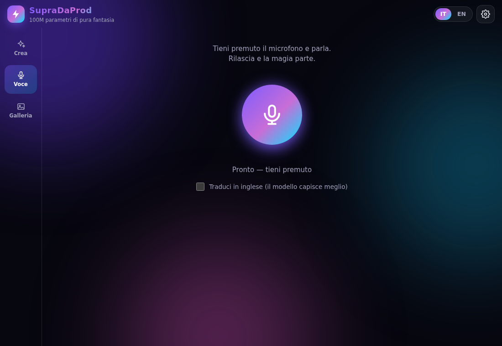
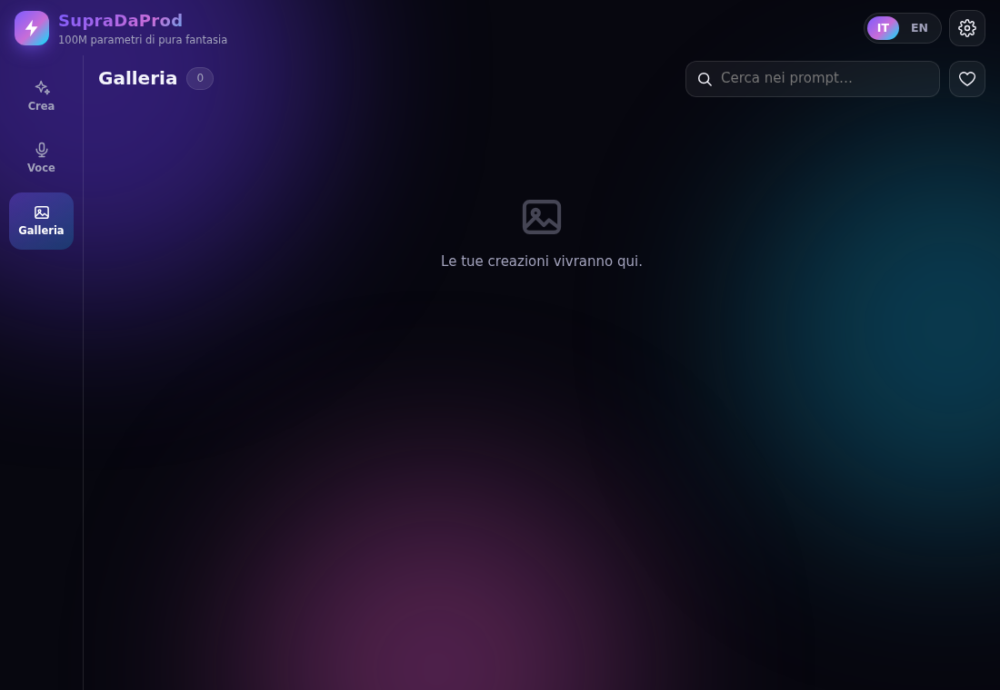
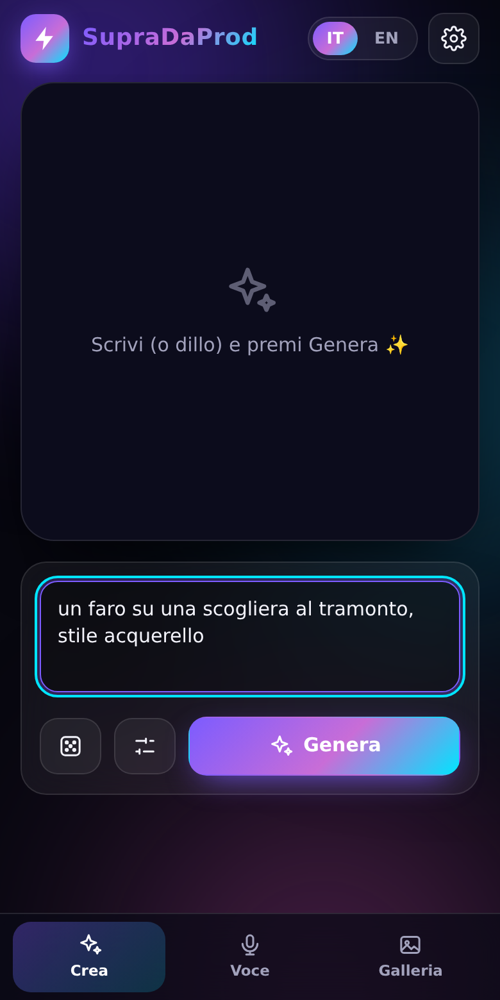
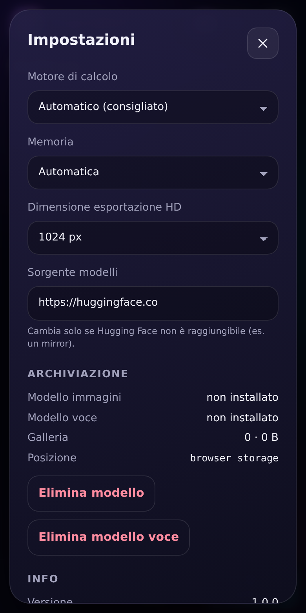

# ⚡ SupraDaProd

> Text-to-image **sul tuo dispositivo** — scrivilo o dillo, un modello da 104M parametri fa il resto.
> Nessun server, nessuna API key, nessun abbonamento. Windows · Android · macOS · Linux.

Powered by **[Supra2-IMG](https://huggingface.co/SupraLabs/Supra2-IMG)** (SupraLabs): un piccolo diffusion
transformer (DiT ~104M parametri) addestrato da zero su 5.6M immagini, output 256×256. Pipeline ONNX di
riferimento: [Bartholomheow/Supra2-IMG-ONNX](https://huggingface.co/Bartholomheow/Supra2-IMG-ONNX).

<p align="center">
  <a href="https://cammo22.github.io/SupraDaProd/"></a>
  <a href="../../releases/latest"></a>
</p>

<p align="center">
  <a href="https://github.com/cammo22/SupraDaProd/actions/workflows/ci.yml"></a>
  <a href="../../releases/latest"></a>
  
  
</p>

## 📸 Screenshot

<p align="center">
  <br>
  <sub><b>Crea</b> — scrivi il prompt, regola passi / fedeltà / seed e premi Genera.</sub>
</p>

<table>
  <tr>
    <td align="center"><br><sub><b>Voce</b> — tieni premuto il microfono e parla</sub></td>
    <td align="center"><br><sub><b>Galleria</b> — tutto salvato in locale</sub></td>
  </tr>
</table>

<p align="center">
  
  &nbsp;&nbsp;
  <br>
  <sub>Interfaccia mobile (Android / PWA): Crea e Impostazioni.</sub>
</p>

## 🚀 Provala subito

La versione web gira direttamente nel browser, senza installare nulla: **[cammo22.github.io/SupraDaProd](https://cammo22.github.io/SupraDaProd/)**.
Al primo uso scarica il modello (~1 GB), poi funziona anche offline. Per le prestazioni migliori usa un browser con **WebGPU** (Chrome/Edge recenti); altrimenti ripiega sulla CPU, più lenta.

## ✨ Cosa fa

| Tab | Funzione |
| --- | --- |
| ✨ **Crea** | Prompt, 🎲 random, passi / fedeltà / seed, prompt negativo, **anteprima live** dell'immagine che si forma, pulsante **Ferma** |
| 🎙 **Voce** | **Tieni premuto** il microfono → parli (🇮🇹/🇬🇧) → rilasci → Whisper trascrive → genera. Opzione "traduci in inglese" |
| 🖼 **Galleria** | Tutto salvato in locale: ricerca, ❤ preferiti, scorri tra le immagini, riusa prompt+seed, variazioni, esporta (anche **HD 1024px**) |
| ⚙ **Impostazioni** | Motore (WebGPU/CPU), modalità memoria, sorgente modelli (mirror), spazio occupato, cartella dati |

Tutto gira in locale. Il modello (~1 GB) si scarica **una volta** al primo uso e poi l'app funziona anche **offline**.

## 📦 Download

Ultima versione → **[Releases](../../releases/latest)**. I link sotto non cambiano mai:

| Piattaforma | File |
| --- | --- |
| 🪟 **Windows – installer** (per-utente, niente admin, IT/EN) | [`SupraDaProd-windows-setup.exe`](../../releases/latest/download/SupraDaProd-windows-setup.exe) (oppure `.msi`) |
| 🪟 **Windows – portable** (un solo `.exe`, non lascia tracce) | [`SupraDaProd-windows-portable.exe`](../../releases/latest/download/SupraDaProd-windows-portable.exe) |
| 🤖 **Android 8+** | [`SupraDaProd-android.apk`](../../releases/latest/download/SupraDaProd-android.apk) |
| 🍎 macOS Apple Silicon / Intel | [`arm64.dmg`](../../releases/latest/download/SupraDaProd-macos-arm64.dmg) · [`x64.dmg`](../../releases/latest/download/SupraDaProd-macos-x64.dmg) |
| 🐧 Linux | [`SupraDaProd-linux.AppImage`](../../releases/latest/download/SupraDaProd-linux.AppImage) · `.deb` |

### 🪟 Portable vs installer
- **Installer**: installa per l'utente corrente (`%LOCALAPPDATA%`), voce nel menu Start, disinstallazione pulita. Se manca WebView2 lo installa da solo.
- **Portable**: copia l'exe dove vuoi (anche su chiavetta). Il nome contiene *portable* → l'app tiene **tutto** (modelli, galleria, persino il profilo WebView2)
  nella cartella `SupraDaProd-data` accanto all'exe. Cancelli la cartella e non resta nulla sul PC. Richiede il runtime **WebView2**, già presente su Windows 10/11 aggiornati.
  Puoi anche forzare la modalità portable creando un file `portable.flag` accanto all'exe.

### 🤖 Android
- Abilita "installa da fonti sconosciute" per il browser/file manager, apri l'APK.
- Il modello (~1 GB) si scarica in Wi-Fi; se la connessione cade **riprende da dove era**.
- Con poca RAM (≤ 4 GB) l'app passa da sola alla **modalità risparmio**: carica e scarica le reti a richiesta, così non viene uccisa dal sistema. Più lenta, ma funziona.
- Le immagini si esportano direttamente in **Galleria → Pictures/SupraDaProd**.
- Il WebGPU su Android dipende dal WebView di sistema; se non c'è si usa la CPU (WASM multi-thread).

### 🌐 Web / PWA (bonus)
La stessa UI gira in qualsiasi browser moderno (storage = OPFS, service worker per isolamento multi-thread e shell offline).
Il workflow `pages.yml` la pubblica su GitHub Pages ([apri l'app](https://cammo22.github.io/SupraDaProd/); la prima volta abilita *Settings → Pages → Source: GitHub Actions*). Su **Android Chrome** puoi "Aggiungi a schermata Home":
Chrome ha WebGPU e più memoria del WebView, quindi è spesso la via più veloce sul telefono.

### 🍎 macOS / 🐧 Linux
Le build macOS non sono firmate: tasto destro → Apri la prima volta. Su Linux WebKitGTK non ha WebGPU, quindi si usa la CPU.

## 🧠 Come funziona

```
           ┌────────────────────────── webview (UI, TypeScript, ~60 KB) ──────────────────────────┐
 prompt ─▶ │  Crea · Voce · Galleria · Impostazioni          Storage (Tauri: file reali / web: OPFS) │
           └───────┬───────────────────────────────┬──────────────────────────────┬────────────────┘
                   │ Worker (off-thread)           │ Worker                        │ download riprendibile
        ┌──────────▼──────────┐          ┌─────────▼────────┐             ┌───────▼────────┐
        │ T5 → DiT (Euler+CFG)│          │ Whisper-tiny q8  │             │ Range + sha256 │
        │ → VAE  (onnxruntime-│          │ (Transformers.js)│             │ → disco        │
        │ web: WebGPU | WASM) │          └──────────────────┘             └────────────────┘
        └─────────────────────┘
```

1. `pipeline_config.json` + 3 modelli ONNX (DiT 417 MB · T5 419 MB · VAE 198 MB) + tokenizer vengono scaricati **su disco**, in streaming, con ripresa (`Range`), retry, watchdog di stallo e verifica **SHA-256**.
2. Il prompt è tokenizzato (T5) e codificato da Flan-T5. Il prompt negativo (vuoto di default) fa da "uncond".
3. Euler flow sampling con CFG: `z += dt·(v_uncond + cfg·(v_cond − v_uncond))` (default 30 passi / 3.0). Stesso seed ⇒ stessa immagine, identica a quella delle versioni 0.x.
4. Durante i passi l'anteprima mostra la **stima dell'immagine finale** (`z + (1−t)·v` proiettata in RGB), non il rumore grezzo.
5. Il VAE decodifica il latente in 256×256; la galleria lo salva su disco.

Tutta l'inferenza è in un **Web Worker**: l'interfaccia resta fluida e **Ferma** funziona sempre, anche su CPU.
Con `COOP/COEP` attivi (l'app li imposta) il WASM usa **più thread**.

## 🔧 Sviluppo

```bash
npm install
npm run dev            # solo frontend nel browser (storage = OPFS)
npm run tauri dev      # app desktop
npm run tauri build    # installer/bundle della tua piattaforma

npm run typecheck && npm test     # tipi + 43 unit test
npm run build && npm run e2e      # Chromium vero + onnxruntime-web vero + "Hugging Face" finto
```

L'e2e (`tests/e2e`) genera con Python un mini-repo Supra2-IMG finto (stessi nomi di tensori, pochi KB di pesi casuali),
lo serve da un hub finto con `Range`/tree-API e guida l'app con Playwright: download, ripresa dopo connessione caduta,
riproducibilità dei seed, prompt negativo, modalità risparmio RAM, annullamento, galleria, offline, voce.
Requisiti: Node 22+, Rust stabile; per e2e `pip install onnx numpy`. Android: Android SDK + NDK, poi `npx tauri android init && node scripts/patch-android.mjs && npx tauri android build --apk`.

### Release
Un tag `vX.Y.Z` fa partire `.github/workflows/release.yml`: builda Windows (installer + msi + portable), macOS, Linux, Android e pubblica la Release
con i nomi stabili qui sopra + `SHA256SUMS.txt`. Da *Actions → Release → Run workflow* ottieni solo gli artifact.

#### Firma Android
Senza segreti l'APK è firmato con una chiave temporanea (si installa, ma per aggiornare devi prima disinstallare). Per aggiornamenti "sopra":

```bash
keytool -genkeypair -keystore supradaprod.keystore -alias supradaprod -keyalg RSA -keysize 2048 -validity 10000
base64 -w0 supradaprod.keystore   # → secret ANDROID_KEYSTORE_BASE64
```
Imposta nei *Secrets* del repo: `ANDROID_KEYSTORE_BASE64`, `ANDROID_KEYSTORE_PASSWORD`, `ANDROID_KEY_ALIAS` (e opz. `ANDROID_KEY_PASSWORD`). Conserva il keystore: se lo perdi non potrai più aggiornare le installazioni esistenti.

## 🩺 Problemi comuni
- **Hugging Face non raggiungibile** (rete aziendale, paese bloccato): Impostazioni → *Sorgente modelli* → inserisci un mirror.
- **Lenta**: in Impostazioni il chip in alto mostra il motore in uso. "CPU (WASM)" è 5–20× più lenta di WebGPU; riduci i passi (10–15 bastano per provare).
- **Crash su telefono**: Impostazioni → Memoria → *Risparmio*.

## 📄 Licenze & crediti
- Codice: MIT
- Pesi [SupraLabs/Supra2-IMG](https://huggingface.co/SupraLabs/Supra2-IMG): Apache-2.0 · conversione ONNX [Bartholomheow/Supra2-IMG-ONNX](https://huggingface.co/Bartholomheow/Supra2-IMG-ONNX): Apache-2.0
- Flan-T5 (Google) · SD-VAE (Stability AI) · Whisper (OpenAI) · onnxruntime-web (Microsoft) · Transformers.js (Hugging Face) · Tauri
